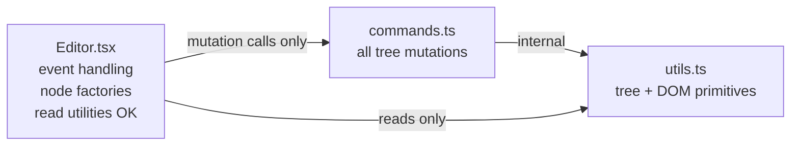

# Plan: Commands-Only Mutations

## Context

**Goal:** All tree mutations in `Editor.tsx` go through `commands.ts`. Commands keep returning `RosetteNode[]`. Read utilities (`getActiveNode`, `getNodeBefore`, `findNodeOfType`, etc.) may remain in Editor.tsx — the constraint is mutations only.

**Current Editor.tsx mutation calls to eliminate:**
- `updateNodeById` — called directly in `beforeInputHandler` (3 branches) and `keyDownHandler` (Enter, Backspace, Tab)
- `insertNodeAtPath` — not currently in Editor.tsx (already only in commands)
- `deleteNodeById` — not currently in Editor.tsx (already only in commands)

The `updateNodeById` calls are the main target.

**Key design principle — pre-create nodes in Editor.tsx:**  
Where a command would normally create a node internally (and Editor.tsx needs the ID to focus it), Editor.tsx instead calls the factory first, retains the reference, then passes the node to the command. This is the same pattern as the existing `insertNodeAfter` / `insertNodeBefore` commands. Commands stay as pure `(nodes, ...args) => RosetteNode[]` transformers.

---

## Architecture



---

## Implementation Steps

### Step 1 — Add `getSelectedTopLevelNodes` to `commands.ts`

Moves the top-level-ancestor-collection logic out of `copyHandler`:

```ts
export const getSelectedTopLevelNodes = (nodes: RosetteNode[]): RosetteNode[] => {
    const selected = getSelectedNodes(nodes); // from utils
    const topNodes: RosetteNode[] = [];
    const seen = new Set<string>();
    for (const { nodePath } of selected) {
        const top = getNodeAtPath(nodes, [nodePath[0]]);
        if (top && !seen.has(top.id)) { topNodes.push(top); seen.add(top.id); }
    }
    return topNodes;
}
```

`copyHandler` becomes:
```tsx
const copyHandler = (e: ClipboardEvent<HTMLDivElement>) => {
    e.preventDefault();
    const selection = window.getSelection();
    if (!selection || selection.isCollapsed) return;
    const topNodes = getSelectedTopLevelNodes(nodes);
    e.clipboardData.setData("text/plain", selection.toString());
    e.clipboardData.setData("application/rosette+json", JSON.stringify(topNodes));
}
```

---

### Step 2 — Add `insertCharacter`, `deleteBackward`, `deleteSoftLineBackward` to `commands.ts`

Replace the three `updateNodeById` call-sites in `beforeInputHandler`.

All three take explicit `nodeId` and offset params (Editor.tsx reads selection and passes the values in — commands stay pure):

```ts
export const insertCharacter = (
    nodes: RosetteNode[],
    nodeId: string,
    text: string,
    startOffset: number,
    endOffset: number
): RosetteNode[] => { /* slice + concat content, updateNodeById */ }

export const deleteBackward = (
    nodes: RosetteNode[],
    nodeId: string,
    startOffset: number,
    endOffset: number,
    isCollapsed: boolean,
    selectedNodes: FindNodeResult[]
): RosetteNode[] => { /* handles single-char and multi-node selection */ }

export const deleteSoftLineBackward = (
    nodes: RosetteNode[],
    nodeId: string,
    endOffset: number
): RosetteNode[] => { /* clear content from 0 to endOffset */ }
```

`beforeInputHandler` becomes:
```tsx
const beforeInputHandler = (e: InputEvent) => {
    e.preventDefault();
    const active = getActiveNode(nodes); // read util — OK
    const range = window.getSelection()?.getRangeAt(0);
    if (!active || !range) return;
    const { node } = active;
    if (node.type !== NODE_TYPES.TEXT) return;

    if (e.inputType === "insertText") {
        replaceNodes(insertCharacter(nodes, node.id, e.data ?? "", range.startOffset, range.endOffset));
        focusNode(node.id, range.startOffset + (e.data?.length ?? 0));
    }
    if (e.inputType === "deleteContentBackward") {
        const selected = getSelectedNodes(nodes); // read util — OK
        const syncedNodes = deleteBackward(nodes, node.id, range.startOffset, range.endOffset, selection.isCollapsed, selected);
        replaceNodes(syncedNodes);
        const focusTarget = selected.length > 0 ? selected[0].node : node;
        focusNode(focusTarget.id, Math.max(0, selection.isCollapsed ? range.startOffset - 1 : range.startOffset));
    }
    if (e.inputType === "deleteSoftLineBackward") {
        replaceNodes(deleteSoftLineBackward(nodes, node.id, range.endOffset));
        focusNode(node.id, 0);
    }
}
```

---

### Step 3 — Add `splitLineAtCursor` to `commands.ts`

Handles Enter key. Editor.tsx pre-creates the new node(s) so it holds the IDs:

```ts
export const splitLineAtCursor = (
    nodes: RosetteNode[],
    activeNodeId: string,
    latterText: string,
    newNode: RosetteNode,           // pre-created by Editor.tsx
    listExitNode?: RosetteNode      // pre-created for the blank-list-item exit case
): RosetteNode[] => { /* existing Enter logic, using passed-in nodes */ }
```

`keyDownHandler` Enter branch:
```tsx
// Editor.tsx creates nodes, retains IDs:
const [formerText, latterText] = [...];

if (isNestedInList && node.content === "") {
    const exitNode = listParentNode ? createListItemNode() : createTextNode();
    const updated = splitLineAtCursor(nodes, node.id, latterText, exitNode, /* ... */);
    replaceNodes(updated);
    focusNode(exitNode.id, 0); // ID known because Editor created it
    return;
}

const newNode = nodePath.length > 1 ? createListItemNode(formerText) : createTextNode(formerText);
const updated = splitLineAtCursor(nodes, node.id, latterText, newNode);
replaceNodes(updated);
focusNode(node.id, 0); // original node now holds latterText
```

---

### Step 4 — Add `mergeWithPreviousLine` to `commands.ts`

Handles Backspace-at-offset-0. Editor.tsx reads the focus target before calling the command (read util usage is fine):

```ts
export const mergeWithPreviousLine = (
    nodes: RosetteNode[],
    activeNodeId: string,
    nodePath: number[],
    nodeBefore: FindNodeResult,
    textNodeBefore: TextNode,
    newNodeForListExit?: RosetteNode  // pre-created if needed
): RosetteNode[] => { /* existing Backspace logic, using updateNodeById/deleteNode */ }
```

`keyDownHandler` Backspace branch:
```tsx
const nodeBefore = getNodeBefore(nodes, node.id); // read util — OK
const textNodeBefore = findNodeOfType(nodeBefore.node, NODE_TYPES.TEXT); // read util — OK

const newNodeForExit = (isFirstListItem) ? {...createTextNode(), id: node.id} : undefined;
const updated = mergeWithPreviousLine(nodes, node.id, nodePath, nodeBefore, textNodeBefore, newNodeForExit);
replaceNodes(updated);
focusNode(focusTarget.id, focusOffset);
```

---

### Step 5 — Add `indentListItem` and `outdentListItem` to `commands.ts`

Tab / Shift+Tab. Editor.tsx pre-creates any new wrapper list node so it can find the text node to focus:

```ts
export const indentListItem = (
    nodes: RosetteNode[],
    parentNodeId: string,
    newWrapperNode: RosetteNode   // pre-created OrderedList/UnorderedList if needed
): RosetteNode[] => { /* Tab logic */ }

export const outdentListItem = (
    nodes: RosetteNode[],
    parentNodeId: string,
    shiftedNode: RosetteNode      // pre-created copy of parentNode
): RosetteNode[] => { /* Shift+Tab logic */ }
```

---

### Step 6 — Add `pasteContent` to `commands.ts`

Editor.tsx handles clipboard reading and node construction (factories stay in Editor); command handles all tree manipulation:

```ts
export const pasteContent = (
    nodes: RosetteNode[],
    pastedNodes: RosetteNode[]
): { nodes: RosetteNode[]; focusNodeId: string; focusOffset: number } | null
```

Note: `pasteContent` is the one exception where returning a plain `RosetteNode[]` isn't enough — the last pasted node has a generated ID that Editor.tsx needs. Since `pastedNodes` are built by Editor.tsx, the last node's ID is already known there. The command can return just `RosetteNode[]` and Editor.tsx computes focus from `pastedNodes[pastedNodes.length - 1]`:

```tsx
const pasteHandler = (e: ClipboardEvent<HTMLDivElement>) => {
    // clipboard reading + node construction stays here
    const updated = pasteContent(nodes, pastedNodes);
    replaceNodes(updated);
    // focus last node — ID known from pastedNodes built above
    const lastNode = pastedNodes[pastedNodes.length - 1];
    const focusTextNode = findNodeOfType(lastNode, NODE_TYPES.TEXT); // read util — OK
    if (focusTextNode) focusNode(focusTextNode.id, focusTextNode.content.length);
}
```

---

### Step 7 — Update `Editor.tsx` imports

```ts
// Remove from utils imports:
updateNodeById   // was the only mutation called directly

// Add to commands imports:
getSelectedTopLevelNodes, insertCharacter, deleteBackward, deleteSoftLineBackward,
splitLineAtCursor, mergeWithPreviousLine, indentListItem, outdentListItem, pasteContent
```

The `getActiveNode`, `getSelectedNodes`, `getNodeBefore`, `findNodeOfType`, `findNodeById`, `getNodeAtPath`, `getParentPath` util imports remain — these are reads.

---

## Verification

1. **No mutation utils in Editor.tsx** — `grep "updateNodeById\|deleteNodeById\|insertNodeAtPath" src/components/Editor/Editor.tsx` returns no matches.
2. **TypeScript compile** — `tsc --noEmit` passes with zero errors.
3. **Manual smoke tests:** typing, delete, multi-select delete, soft-line delete, Enter (top-level and in lists, blank list item exit), Backspace merge (top-level and list boundaries), Tab/Shift+Tab indent/outdent, copy/paste rosette JSON and plain text, toolbar buttons.

---

## Critical Files

- [`src/components/Editor/Editor.tsx`](src/components/Editor/Editor.tsx) — remove `updateNodeById` import; slim each handler
- [`src/nodes/commands.ts`](src/nodes/commands.ts) — add 7 new command functions
- [`src/nodes/utils.ts`](src/nodes/utils.ts) — no changes needed
